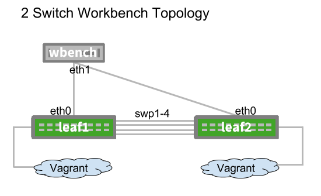

# Cumulus 2 Switch Workbench Simulation
=====================

This demo creates a facsimile of a 2-switch Cumulus Customer Workbench. This
includes 2 "leaf" switches with swp1-swp4 connected together, and a
workbench virtual machine configured appropriately. You can install & use
Cumulus demos which work on a 2s switch topology.

**Note:**
Keep in mind that not all labs can be accomplished in a virtual environment. Licensing, Slots and ONIE do not presently exist in Cumulus Vx to be simulated.

# Software to Install
To use this virtual environment, the following dependencies are required:
* Virtualbox 5.0+ ( https://www.virtualbox.org/wiki/Downloads )
* Vagrant 1.7+ ( https://www.vagrantup.com/downloads.html )
* Vagrant-Cumulus Plugin (install with "vagrant plugin install vagrant-cumulus")
* Ansible 1.9+ ( http://docs.ansible.com/ansible/intro_installation.html )

# Getting Started
After installing the software listed above move to this directory and execute the "vagrant up" command. At this point all three devices will boot up and provision the necessary software. When this process is complete run the command "vagrant ssh wbench" to get to the workbench VM.

**Note:**
Vagrant uses the interface named "vagrant" to communicate and control the different VMs which are being simulated so take care to not disturb this interface in the /etc/network/interfaces file if you would like to maintain Vagrant's ability to establish an SSH session directly to a particular device.
